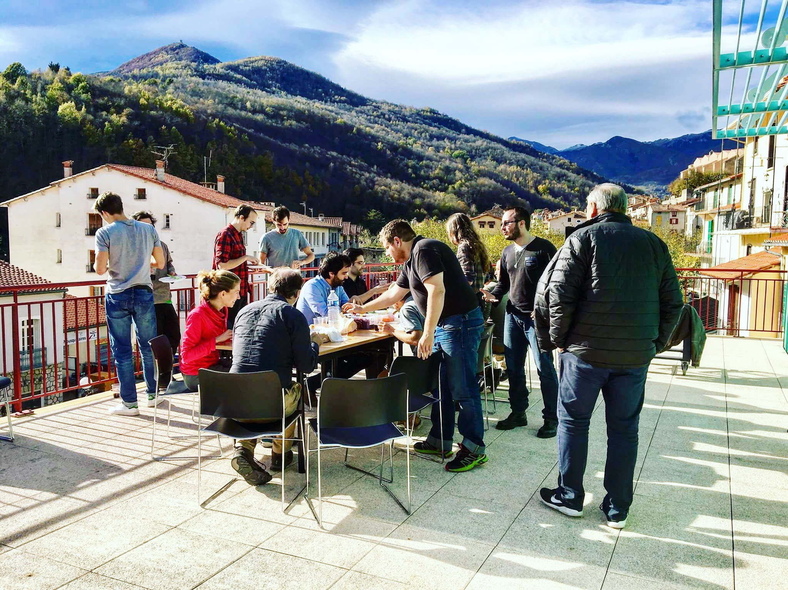
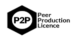

# What does "citizen based research program" means for energy transition ?

In a context of climate change fight and growing resources scarcity, renewable energy sources are known to play a more and more central role in energy production. Nevertheless, the penetration of high share of renewable energy sources in electricity production raises intricate issues concerning the power system management : the variability of their output, their relatively low predictability and their low inertia make them unsuitable for a proper control in order to guarantee the supply - demand equilibrium. Two very opposite strategies can be depicted to help their integration :

* through a trans-national power grid;
* through the profusion of small power systems at a local scale: development of local renewable energy projects coupled with small storage systems, energy efficiency programs and the appropriation of energy as a scarce and necessary resource by

  citizens so they can engage in the energy transition process.

In the case of the local strategy, there will be two main issues:

* A technical issue: how can a local power system mainly, or even only, based on renewable energy sources, ensure power offer-demand equilibrium?
* A social issue: how can local population be involved in the process of energy transition while dealing with growing complexity of the field?

Thus the second strategy involves technical innovation AND social innovation bringing complex issues that will be addressed in this research project through the situated research context of the village Prats de Mollo La Preste in the French Pyrénées \(Prats' EnR\). This research project is part of a broader research program called DAISEE which aims at experimenting and producing shared knowledge and experience in the case of complex transition context issues.

The ​ _main long-term objective_ of the project is to ​**produce knowledge and provide experience feedbacks for locally citizen-governed power system transition that could be used in other contexts**​ .

The _specific aim of the research project in Prats de Mollo_ is about ​**experimenting a Citizen-Governed Data Platform applied to local energy \(mainly electricity\) balance management, in the context of high renewable share on a local grid**​ , which governance can be distributed among various stakeholders under various energy usage. The research and scientific question not only focuses on the local balance through smarter grid management but also on the impact of a distributed and shared governance of the grid amongst the stakeholders, helped by emerging information technologies through a data management system. Such a question requires transdisciplinary and situated research, and calls for a citizen-science/research approach. Consequently, the aim is to address the issue of what could be called smart energy and grid management through the prism of shared energy data and algorithm governance with citizens; meaning that technological and technical questions will be addressed side to side with social and legal compliance, while constantly keeping in mind the necessary interoperability with other infrastructures and systems.

More specifically the research project is about :

* **Understanding technical, economic, legal and social** requirements for high renewable energy sources integration into local power systems.
* **Assessing the different options** for addressing the requirements and their relevance according to the local context through the prism of energy data and grid management, within the context of the experimentation of a Citizen-Governed Data Platform.
* **Experimenting** one or more options in collaboration with the population and the local power utility, in the case of the experimental field of Prats'EnR.
* **Producing open-knowledge and providing experience feedbacks** for locally citizen-governed power system transition that could be used in other contexts.

In other words, the overall program aims at deepening knowledge in three layers :

* the hardware level with the smart energy metering,
* the data infrastructure level with the data management instance,
* the physical infrastructure with the "smart" micro grid​ .

All three of those layers embed multi-fields and transdisciplinary technical and social scientific issues all pointing to a political and social entry point: the governance of energy. Within the scope of the post-doctoral project, the aim is to focus on the third layer \(the physical infrastructure\) and its design and development for high renewable penetration on a local grid with multiple energy usage, while being supported by the work on the the first and second levels that will help building the overall infrastructure for an agile interoperable citizen-governed power system.

## Going beyond state-of-the-art.

A **Citizen-Governed Data Platform \(CGDP\)** has not yet been explored to manage the power system: if both demand and offer side management has been the topic of extended research, it has been either through the techno-control and centralized decisional power, or through the social and economic incentivization and campaign awareness dynamics for either lowering consumption or consuming green energy. Some dispersed, and yet to be developed research projects, are starting to bridge social governance of energy infrastructures and technical grid and peer negotiation for common energy management \(Moret, Pinson 2017, project - Mihaylov et al., 2016\). However, still few research projects address the question through the complexity of autonomously managing energy as a common resources through shared governance at the local grid scale; meaning the technical and social/political issues but also the legal and economic stakes.

With the development of local **energy communities**, the capacity for anyone to produce and consume its own electricity, the possibility for local market place to emerge and locally trade energy, the development of smart/micro grid ... it appears as pressing issue to deal with the emerging complex governance and management of the grids. One key assumption is that the frontiers between consumers and producers are shrinking and grid distribution stakeholder diversifying, while more and more digital/intelligence is put to make the energy management smarter, hereas the smartness is not embedded within the grid or technical processes but in the communities \(Gurstein, 2014 et Sadoway & Shekhar, 2014\).

The aim of the research project is to go beyond the various technical optimization strategies to focus on the grid management within the context of high renewable penetration from various sources \(hydroelectric power, personal and professional photovoltaïc, methanation...\) and usage \(self production and consumption, pure production, storage, distribution...\) through shared citizen energy data and algorithmic management that is governed by its owners. CGDP has been designed and conceptualized in various other context \(local mobility, local waste management, independant cloud platform for knowledge sharing...\) but none has been designed, conceptualized and experimented in the energy sector for managing energy as a common \(meaning as a shared resource amongst a community of users and contributors who define the governance rules of that same resource\).

Consequently, the core of the research project which is **the local energy balance in the case of high renewable penetration on the grid through a Citizen-Governed-Data-Platform based management** appears as unique in the field and goes beyond the state-of-the-art, while working at integrating the various models described in the litterature for energy management in both modelisation, simulation and tool development approaches.

## Innovative nature of the research proposal

Part of the DAISEE project is attached in building such a CGDP and has already organized several meetings and workshops on site, at Prats-de-Mollo, with the local utility and about 20 citizens involved in the project as well as the local government.

The innovative nature of the experimentation research project lies in the core proposition: a Citizen-Governed-Data-Platform for energy and grid management in order to guarantee local energy balance while considering high renewable energy share on the grid. Experimenting a citizen-governed grid for energy balance is innovative from various perspectives:

* technical and technological: how to handle citizen governance of the grid while assuring local equilibrium from various renewable energy production and usage ?
* social and political: how to govern a multi-agent grid and have a shared definition of the rules to manage a common resource ?
* legal and insurancial: how do technical implementation for data management and algorithms comply with legal and insurance requirements ?
* industrial and economical: how is created value addressed within a shared governance pattern?
* last of all the context in which this research project is handled.

The innovative nature of the experimentation research project also resides in the context in which it is held:

* a transdisciplinary - if not [**antidisciplinary**](https://joi.ito.com/weblog/2014/10/02/antidisciplinar.html) - approach that is needed to tackle both the complexity of the field and topic;
* a **non-standard and high quality environment** aiming at producing open-knowledge and science in the case of situated research on concrete experimentation field within a highly connected network of curious minds, experts, other research institutes and fields, civil society and civictech movement, high-end technological companies as well as open-culture communities ...;
* an approach of energy and grid management that thinks and builds the transition of energy systems as part of **industrial and societal paradigm shift**.

## DAISEE: Citizen research

The DAISEE’s methodology is based upon globally distributed contributive non-standard research network. The working process in the case of the DAISEE research program is situated and directly link to scientific problematic and experimentation necessity on field

**Why is such research called “non-standard” ?** Mainly because it is relying on hybridization of disciplines and addressing complexity through [antidisciplinary](https://joi.ito.com/weblog/2014/10/02/antidisciplinar.html) approach rather than hyper-specialized and closed dynamics. In practice, the DAISEE approach is “non-standard” because we value and practice :

1. Organizational Ethnography \(Pragmatism\)
2. Shared governance \(Ethics\)
3. Open-knowledge \(Commons\)
4. Learning by doing through experimentation and iteration \(Design\)
5. Hybridization of communities, field and disciplines \(Heterotopia\)

Community working process means learning, producing and disseminating knowledge through:

* Working Groups \(continuous\) : to learn and prototype
* Meetups \(1 / month\) : to get to know the people and the field
* Bootcamps \(1 / month\) : to enhance peer-to-peer learning and cross fertilization
* Residencies \(1 / quarter\) : to experiment on the field
* Doc Sprints \(1 / quarter\) : to capitalize, document and publish
* DevCon \(1 / year\) : to share and disseminate knowledge and cross communities expertise

In the case of our contributive residencies for instance, methodology process can be formalized as followed:

* Diagnostics and ground knowledge
* Defining research and experimentation questions depending of the field \(situated action-research\)
* Prototyping and knowledge production through contributive residency gathering a distributed “non-standard” network of research network
* Grassroots experience
* Capitalization of knowledge and experiences

## Some bibliographical references

* Abikarram, Jose Batista, and Katie McConky. 2017. “Real Time Machine Coordination for Instantaneous Load Smoothing and Photovoltaic Intermittency Mitigation.” ​ Journal of Cleaner Production ​ 142 \(January\):1406–16
* Amato A., et al., 2015 "Design and evaluation of P2P overlays for energy negotiation in smart micro-grid", Comput. Stand. Interfaces \(2015\)
* Baldwin, Elizabeth, Valerie Rountree, and Janet Jock. 2018. “Distributed Resources and Distributed Governance: Stakeholder Participation in Demand Side Management Governance.” ​ Energy Research & Social Science ​ 39 \(May\):37–45
* Gurstein Michael, 2014, "Smart Cities vs. Smart Communities: Empowering Citizens not Market Economics", Journal of community informatics
* Jacobson, M.Z., et al., 2013, "Examining the feasibility of converting New York State’s all-purpose energy infrastructure to one using wind, water, and sunlight". Energy Policy
* Koltsaklis, Nikolaos E., et al. 2017. “Impact of the Penetration of Renewables on Flexibility Needs.” ​ Energy Policy ​ 109 \(October\):360–69
* Mihaylov Mihail et al., 2016, "NRG-X-Change: a Novel Mechanism for Trading of Renewable Energy in Smart Grids"
* Mihaylov Mihail et al., 2016, "Smart grid demonstration platform for Renewable Energy Exchange", Advanced in Practical Application of Scalable Multi-agent Systems, 14th International Conference PAAMS 2016
* Moret Fabio, Pinson Pierre, 2017, "Energy Collectives: a Collaborative Approach to Future Consumer-Centric Electricity Markets", Technical University of Denmark
* Lovell, Heather, Veryan Hann, and Phillipa Watson. 2017. “Rural Laboratories and Experiment at the Fringes: A Case Study of a Smart Grid on Bruny Island, Australia.” Energy Research & Social Science ​ , October
* Lovell, Heather, Martin Pullinger, and Janette Webb. 2017. “How Do Meters Mediate ? Energy Meters, Boundary Objects and Household Transitions in Australia and the United Kingdom.” ​ Energy Research & Social Science ​ 34 \(December\):252–59
* Peng Xiaoyang, and Jean Wild. 2017. “Innovative Microgrid Solution for Renewable Energy Integration within the REIDS Initiative.” ​ Energy Procedia ​ , Leveraging Energy Technologies and Policy Options for Low Carbon Cities, 143 \(December\):599–604
* Peyricot Olivier, Pole Recherche de la Cité du Design de Saint-Etienne, 2016, "Smart grids, territoires et habitants. L’interaction entre la visibilité des usages et l’efficacité énergétique.", Rapport d'Etude PUCA
* Rodriguez, Rolando A., Sarah Becker, and Martin Greiner. 2015. “Cost-Optimal Design of a Simplified, Highly Renewable Pan-European Electricity System.” ​ Energy 83 \(April\):658–68.
* Sadoway David & Shekhar Satyarupa , 2014, "\(Re\)Prioritizing Citizens in Smart Cities Governance:Examples of Smart Citizenship from Urban India" Journal of community informatics
* Wang, Zongjie, and Zhizhong Guo. 2018. “On Critical Timescale of Real-Time Power Balancing in Power Systems with Intermittent Power Sources.” ​Electric Power Systems Research ​ 155 \(February\):246–53

> This production is under the [Peer Production License](https://wiki.p2pfoundation.net/Peer_Production_License) terms.

> The peer production license is an example of the [Copyfair](https://wiki.p2pfoundation.net/CopyFair_License) type of license, in which only other commoners, cooperatives and nonprofits can share and re-use the material, but not commercial entities intent on making profit through the commons without explicit reciprocity
>
> This article is based on an original [application to the Axa Research Fund](https://docs.google.com/document/d/1VnmetHkyE-zxc2WmkZH3QzQvyjzNczNathljPmJOKL4/edit?usp=sharing) co-produced by [La MYNE](https://lamyne.org/), Cellabz, [CNRS Promes](https://promes.cnrs.fr/) and [PratsEnR](https://cloud.lamyne.org/s/4Z2agRHmLy9CbiS) which usage is under the CC-BY-SA license terms.

