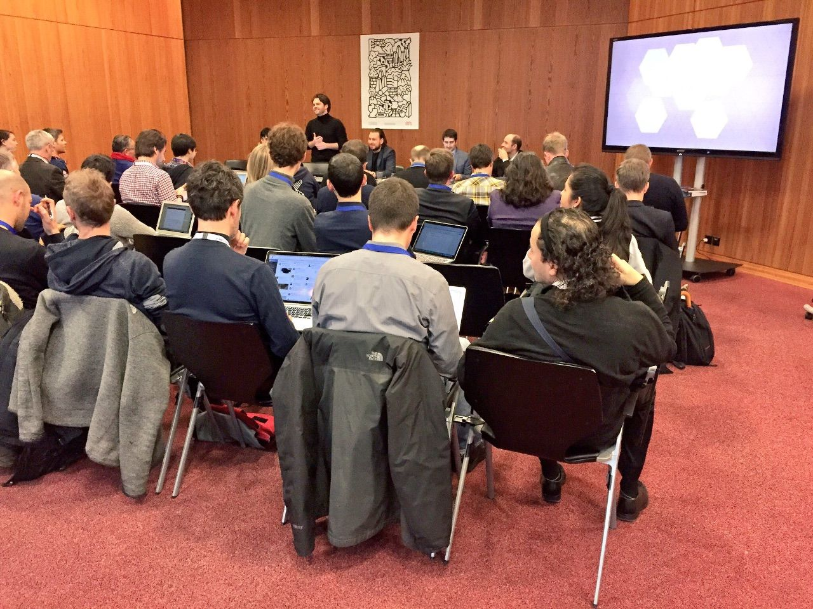
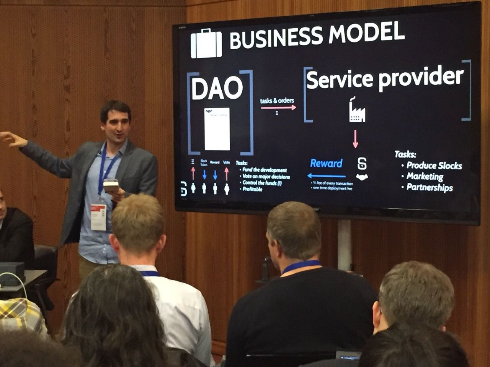
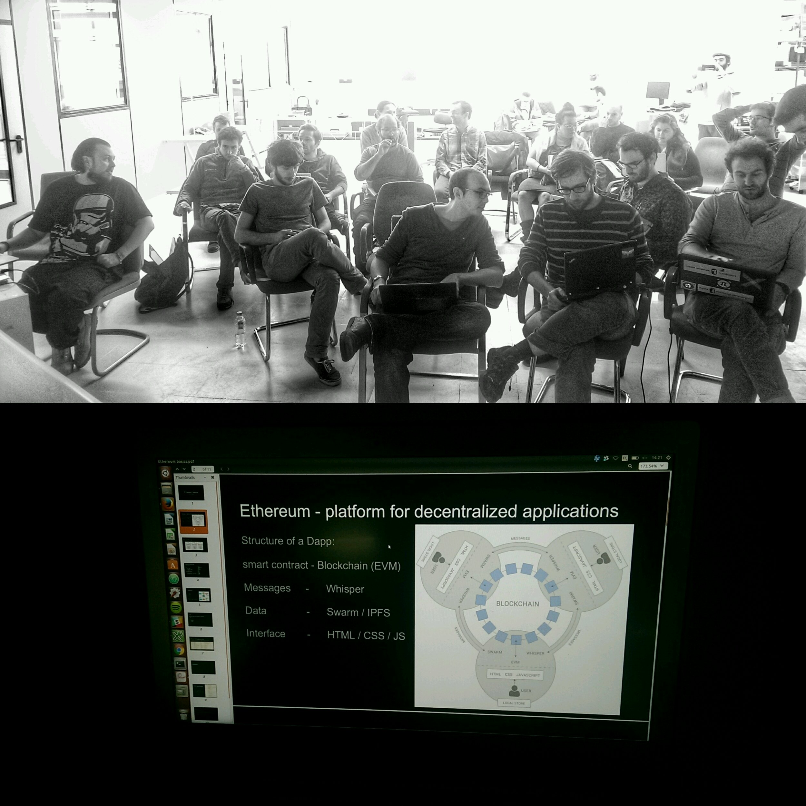
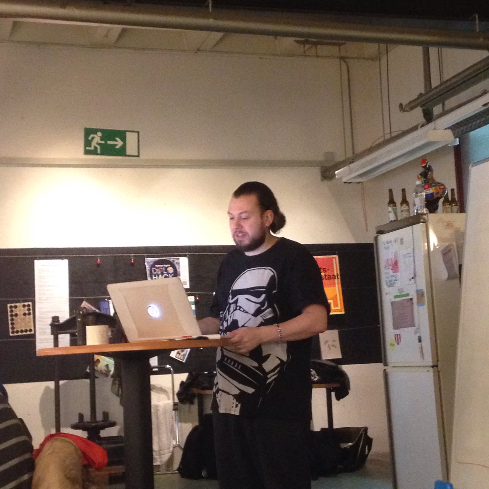
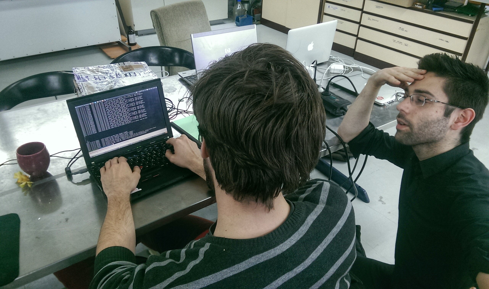
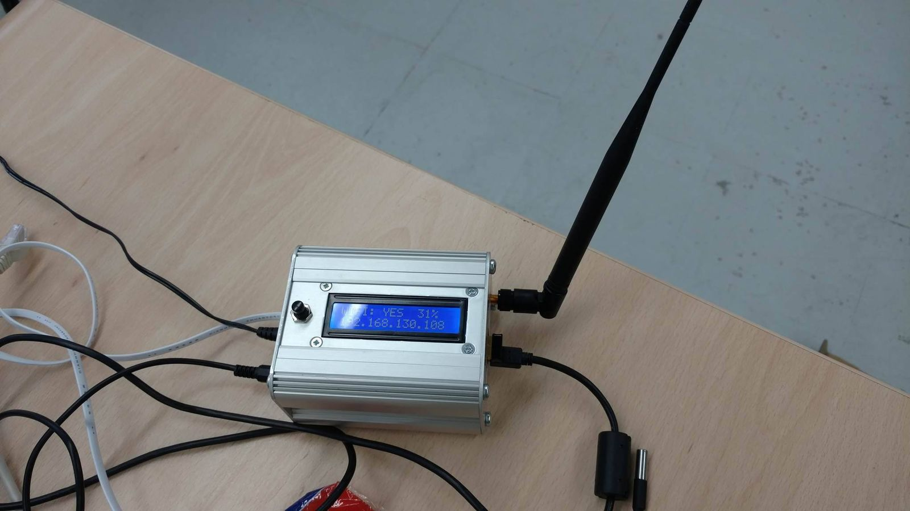
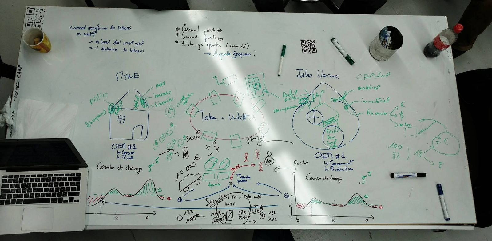

# Ep. 0 - Cellcamp 2016 - Lift me up with blockchain

It's for sure that the DAISEE adventure has started long before all this. In fact, it all began with a talk with Clement and Nicolas about blockchain ... 

At the end of 2015, Clément and Nicolas has been following the "[Sydney Blockchain Workshops](https://www.youtube.com/channel/UC9Lmf5FfNkSmYMoxhQh5ktA)" co-organized by [Cellabz](https://web.archive.org/web/20180105201128/http://cellabz.com/) and [COALA](https://www.coalaip.org/), and more specifically the "[Innovation Challenge](https://docs.google.com/document/d/1c4VOrnsaiucLJY8r34XaTpF3IbIQzr27NdVH6fo8bJo/edit?usp=sharing)". An energy project \(Elethron - energy project based on the [Ethereum blockchain](https://ethereum.org/)\) was presented to the challenge ad picked our curiosity : "what if we were working the - reductive - blockchain-energy topic in an citizenlab environment like [la MYNE](https://lamyne.org) ?". 

In a nutshell, if we were to find a begining to all this, undoubtedly it was further to our discussions early in 2016 after the Sydney BC Workshop, during the three days of residence organized by Cellabz around the [2016 Lift conference](http://liftconference.com/) [blockchain track ](https://www.youtube.com/watch?v=qMsDozl4wjI)gathering curious minds from diverse backgrounds, interested in understanding and working the potential of blockchain technologies beyond the state of the art of applications.



### 1st step : jump in !

> From conference stage, to workshop, to private community masterclass : introduction to ethereum and DAO

We're a bunch of curious people. Some didn't know a thing about blockchain technologies \(just the philosophy and fonctionning principle\), while others  had notions or even a bit of practice. But all of us were excited to learn and practice, meet and discuss, and work together on the convergence of what we could call a "tech-community" \(such as [Ethereum](https://ethereum.org/)\) with an "industrial or infrastructural sector" \(such as energy\). Well... you could argue - and you would be right - that ethereum is about infrastructure and energy about tech as well; but they're from a different century or generation. 

> Is it relevant and how to work established, institionalized and "past-century" sectors \(energy, mobility, law, science, health ...\) through the blockchain prism ?

We were first introduced to blockchain and DAO by Stephan Tual



then by Joseph Lubin



and finally with Primavera de Filippi



all this giving us a glimps of the actual variety of the propositions and core technology. It was interesting to note that applications, at that time, was really limited to few use cases.

We then went further into details with our guests and... some other ones with the workshop "[Blockchain and beyond](https://paper.dropbox.com/doc/LIFT16-Blockchain-Beyond--A0MH~qVJbXes1rR_UdMYNCWrAQ-d56JxlAJYJTre8nTdn4oO)". 

> [Audio transciption of the discussions](https://www.mixcloud.com/widget/iframe/?hide_cover=1&mini=1&feed=%2Fhanniju%2F01-lift16-workshop%2F)

We ended-up the workshop on this slide, which will highly drive the vision model of an energy DAO in our thinking at DAISEE :

### 2nd step : dig in and homeworking.

> [What's a CellCamp - in french](https://www.mixcloud.com/widget/iframe/?hide_cover=1&mini=1&feed=%2Fhanniju%2F03-pr%C3%A9sentation-du-cellcamp%2F) ?

To dig in complex intricated community driven crypto technologies it is necessary to go "drink at source" - as a friend of ours would say ! One of the source, was the instigators of [Slockit](https://slock.it/) and more particularly the ones behind [the DAO,](https://en.wikipedia.org/wiki/The_DAO_%28organization%29) namely Stephan Tual, Simon Jentzsch, Christoph Jentzsch. We had the chance and opportunity to participate to a private masterclass with Stephan and Christoph, as well as 2 full days of pratice with them both to mentor us.

> [Know more about Stephan Tual at that time](https://www.mixcloud.com/widget/iframe/?hide_cover=1&mini=1&feed=%2Fhanniju%2F02-stephan-tual-interview%2F)

Then, while drinking directly at source of the knowledge and experience - remember that we're early in 2016 and blockchains are not yet mainstream bullshit topics to discuss -, linking both theory and practice through praticing strongly helps appropriation and determining what are the key elements to bear in mind while working a topic through the prism of the Ethereum blockchain ! The process thus necessarily goes through an [Ethereum Install Party](https://paper.dropbox.com/doc/cellcamp-Documentation-V0.1--A0PaEs0pbfF9n5NRlwYI13EgAg-BG6sbFf2oaFd4813wvtls#:uid=661792681317628938187367&h2=IV--13-02-2016---Ethereum-Inst) !

At the end of this 2nd step, which was also the 2nd day of the residence, we knew a bit more about blockchains, and more specifically Ethereum, we were all a node of a local blockchain on our computer further to the install party, we've started mining some ethers, traded them, and finally we've started to dig in the smart-contract stuff - which are nor "smart" neither "contract" !

### 3rd step : working the energy topic !

**Topic** : use cases to be developped in articulation between [slock.it](https://slock.it/) and any pool of devices necessitating regulation \(it could be energy regulation between peer, or autonomous device regulating its own environment...\). **Note** : in any of the working cases, emitted tokens are watt.h.

#### Use case n°1 : energy with [Open Energy Monitor](https://openenergymonitor.org/) \(OEM\)

**Set-up** : 

1. An OEM in 2 different places : at [la MYNE](https://lamyne.org) and at [la Maison Jules Vernes](https://movilab.org/wiki/La_maison_Jules_Verne).
2. Audit of the consumption curves of the 2 places in order to determine a dynamic mean consumption curve for each place. 
3. For each place, determine in real time the deviation to the mean curve to assess under and over consumption.
4. Each system is able to trade tokens depending of the deviation to the mean value, meaning :

* if one place is overconsuming while the other one is underconsuming, realtively to their mean consuming curve, then the smart-contract tells "_send X tokens from the one underconsuming to the one oversconsuming_";
* if the 2 places are overconsuming, then the smart-contract tells "_withdraw X tokens to both_";
* if the 2 places are underconsuming, then the smart-contract tells "_give X tokens to both_".

**Note** : in this case, energy quanta \(Wh\) are tokenized.

#### Use case n°2 :  aquaponics module environment regulation

**Set-up** : 

1. The aquaponics module is monitored \(water temperatuve, nitrate, pH ...\).
2. The aquaponics module has its own wallet and is a node of the local ethereum blockchain.
3. People make transactions with the aquaponics module in order to take care of the fishes and plants

**Underlyng idea** : like a [Plantoid](https://www.plantoidproject.eu/) , the aim is to set up a biologically link DAO at the scale of an aquaponics module pool, in order for it to autoadapt, autoreplicate and enable the reward of the projects teams.

**Link between the "Energy" and "Aquaponics" use cases** : the aquaponics module requires energy. A contract could link the OEM with the aquaponics module to enhance autonomization of the module and cross rewarding between projet teams.

#### Use Case n°3 : energy atoregulation at the scale of a pool of devices

**Set-up** : 

1. Each device of the pool that consumes electricity has a wallet. 
2. A mean consumption curve for each device along the day is estimated. 
3. Devices trade energy via "energy-token" autonomously between each other to manage the electricy consumption, providing that some devices produce electricy.

* if no device produces energy, "reputation-tokens" are traded between devices depending on the deviation to the mean consumption curve value;
* if overconsumption cannot be compensate within the pool of devices "reputation-tokens" are traded between devices depending on the deviation to the mean consumption curve value.

#### Final use case

> This use case has been selected for further experimentation

**Set-up** : use the OEM \(Open Energy Monitor\) to monitor both the electricity consumption and production at the scale of a pool of energy producing and consuming entities.

**Principle** : any efforts to produce and consume "green" electricity gives the possibility to earn and accumulate tokens that can be traded.

**Aim** : rewarding of the "green efforts" through the possibility to trade tokens with other entities in a pooled purchase logic.

**Functionning example** : the pool of energy producing and consuming entities need to buy electricity from outside and share a common bill. The payment distribution of the bill is dynamically done given the plus and minus accumulated tokens. A common pot gathers the accumulated tokens that are use for investment in common project. The decision process requires to work-out the consensus algorithm.

**Questions** :

* What are the smart-constracts to be developed ?
* What is the data update frequency to estimate the common consumption ?
* Does a high frequency could result in high transaction costs ? An answer could be to transact only in the case of high overconsumption.
* How to deal with the field specificities ?

> This production is under the [Peer Production License](https://wiki.p2pfoundation.net/Peer_Production_License) terms.

> The peer production license is an example of the [Copyfair](https://wiki.p2pfoundation.net/CopyFair_License) type of license, in which only other commoners, cooperatives and nonprofits can share and re-use the material, but not commercial entities intent on making profit through the commons without explicit reciprocity
>
> This article is based on an original [application to the Axa Research Fund](https://docs.google.com/document/d/1VnmetHkyE-zxc2WmkZH3QzQvyjzNczNathljPmJOKL4/edit?usp=sharing) co-produced by [La MYNE](https://lamyne.org/), Cellabz, [CNRS Promes](https://promes.cnrs.fr/) and [PratsEnR](https://cloud.lamyne.org/s/4Z2agRHmLy9CbiS) which usage is under the CC-BY-SA license terms.

