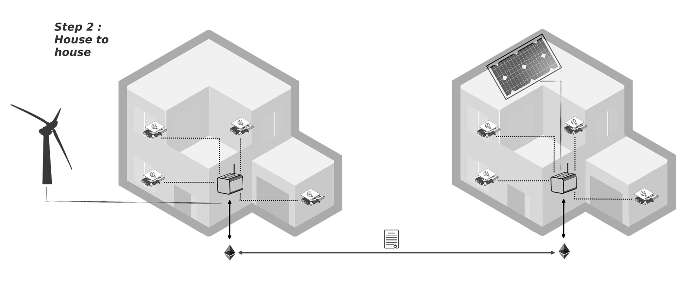

# Ep. 1 - Call Me DAISEE : the hackaday prize root of the projet

## Preliminary note : What's the [Hackaday Prize challenge](https://hackaday.io/contest/10144-the-2016-hackaday-prize) ? 

### "Build Something That Matters"

The Hackaday Prize is empowering hackers, designers, and engineers to use their time to **Build Something that Matters**. For the next five weeks what matters is solving a technology problem. Have an idea to power vehicles without polluting the atmosphere? Great! Want to figure out how to get your washing machine to work better? We want to see that too. Anything goes so design it, prototype it, document it and you could be one of the twenty entries headed to the final round.

> We're asking for solutions to address technology issues facing humanity today. With a new technical design challenge every 5 weeks, you are expanding the frontiers of knowledge and engineering. Design an impactful project that suits you, or collaborate with someone else to do it. With our global collaboration platform, your project can be moving forward at all hours of the day. Create things like a better radiation monitoring system, a better calorimeter, open source instrumentation, digital logging scales and exercise trackers.
>
> We’re starting off with an Idea Slam, where you can submit a Design Concept. Then we give you 4 more Hackaday Prize challenges to run with. These 5 challenges run in serial \(one after the other\) and each challenge lasts just 5 weeks. Big things start with just an idea, and if you want them to, concept drawings can bring in collaborators.
>
> 20 projects will be chosen from each of the 5 rounds, and awarded $1000 per project.
>
> At the end of all 5 rounds, 100 projects in total will advance to the finals, where 5 will win $150k, $25k, $10k, $10k and $5k. In addition the 1st place project will win a residency in the Supplyframe Design lab to develop their project further.

## From centralized to distributed thinking

Up today, the easiest way to provide fairly important amounts of energy to a relatively big amount of people was to build big power plants \(from coal to nuclear also using gas and hydropower\) with heavy infrastructures \(big pipes that go through the territories and more little pipes that go from the substations to homes\). Such a system is relying on low-cost and abundant non-renewable resources.

With the increase of both local and global energy consumption, resources \(very fast\) depletion, climate change and... renewable energy costs plummeting, the system has started to evolve... So, more and more it looks like pretty much like that

A more decentralized organization relying on diffuse renewable resources. This means that production points are more local and close to consumption points.

However, such a system is based on existing infrastructures and local electricity producers are usually not the owners of the produced good \(electricity\) since they are constrains by regulatory laws making it compulsory either to sell the electricity to another bigger producer or a dispatcher, or to consume its own electricity.

There are mainly 4 problems:

* First, energy producers and dispatchers do not know well \(usually not at all\) the real time consumption pattern at the micro-level, meaning they do not have meaningful energy consumption information on their clients that would help to real time optimize the production/consumption balance;
* Second, in current systems energy losses are huge \(between 7 and 12% of the total production\) because of losses in the pipes making the grid;
* Third, the current systems do not take the full potential of local resources; those systems are not in place and not consistent with developing countries issues about energy accessibility because not resilient enough;
* Last but not least, consumers do not get real interaction with energy, making raising awareness on reducing energy consumption hard. The only relation you've got with your energy provider is, first the bill, second the switch.

The are then 4 big issues levels:

* The increasing complexity of the energy system and organization;
* The cost of a trusted 3rd party \(specifically the one enabling distribution\);
* The complexity and inconsistency of the regional regulatory contexts;
* The consumer side: how to get people involved in energy governance?

The solution that is proposed here to solve those problems is to experiment and move towards a \(more\) DISTRIBUTED energy systems organization, like that

Like the internets we strongly believe that DISTRIBUTED energy systems will help to develop DECENTRALIZED AUTONOMOUS energy ORGANIZATIONS, thus providing strong and resilient answers to the here-above mentioned challenges.

## **What are the challenges to solve the problem?**

### _Secure energy data_

We _could_ access to meaningful and secured energy consumption and production data with monitoring systems like [Open Energy Monitor](https://openenergymonitor.org/emon/) with embedded installed [Ethereum](http://ethereum.org) \(light\) clients to record energy flows on a distributed ledger \("blockchain"\). This gives the opportunity to secure and validate data and to access "pseudonymous" consumption and production energy data to facilitate transactions.

### _Reduce energy losses_

Relying on peer-to-peer energy transaction through micro-grid at the local level makes it possible to significantly reduce energy losses in the grid since electricity does not have to cross the country to reach the consumption point.

### _Create "short circuits"_

Locally distributed energy systems that are interconnected one to another make it possible to take full advantage of diffuse local resources \(sun, wind, hydro, electro-chemical electricity production - from plants and bacteria...\) while strengthening the resilience of the system, since what's produced locally is locally consumed.

### _Open energy governance_

Consumers are part of the equation, if not the central and main actor while talking about energy. A distributed system makes it possible to switch from pure consumer to "prosumers", giving a way for people to be involved in energy governance. Not only this helps to tackle on-ground needs but also to make energy a palpable good.

## **What is the mission of DAISEE in this context?**

DAISEE's mission is to build the "Internets of Energy" and organise energy as a common. We have to deploy open-source secured decentralized autonomous energy production systems and consumption monitoring, in line with building micro-grid infrastructures, thus enabling trusted peer-to-peer energy transactions.

There are 3 packages in the master plan:

* **Energy monitoring**: how to securely monitor energy consumption / production on a system based on open-source technologies?
* **Machine dialogue**: how to make objects take consensual decisions while dealing energy-token between them about who’s consuming what-when-how they contribute to energy consumption reduction ?
* **Trusted transactions**: how to make it possible to make peer-to-peer energy transactions at the district / town / territory level

## **What are the provisional development steps?**

1. Energy monitoring : set up sensors, check various data transfer and data.
2. Make the sensor communicate: install an ethereum client on two sensors and make them communicate through a basic smart contract on the blockchain
3. Make things work with a sensor in each house and test the first transactions.
4. Make things work between more than two houses \(and deploy micro-grids\)

## **What is the mission statement of DAISEE?**

**Our vision**: everyone will be an energy "prosumer" and will share energy data and deal energy within a decentralized, trusted and secured global infrastructure.

**Our soul**: energy as common\(s\). In other words : trusted co or inter-dependance which does not necessitate any intermediary for dealing with any of the flows related to a house/district/territory \(i.e.: energy, transport, waste, materials...\).

**Our compass**: deploy "DAOs" to foster autonomy in sectors such as energy.

**Our community**: we bootstrap DAISEE with talented people from "**La M\[Y\]NE**" and "**Cellabz**" among a broader community \(particularly including [**CitizenWatt**](http://www.citizenwatt.paris)\).

* "**La M\[Y\]NE**" is a '[tiers-lieu](https://en.wikipedia.org/wiki/Third_place)' \(based in Lyon\) dedicated to sustainable issues. People come from various backgrounds to solve concrete problems.
* **Cellabz** is a 'labs builder' who combine blockchain with emerging technologies.
* **CitizenWatt** is a community who builds low-cot open-source energy monitoring and data viz systems. It aims at redefine the smart energy monitor as we know it towards acceptable eco-feedback technologies that are non-intrusive, and individual control and autoregulation of energy consumption.

## **Who are the people at the initiative?**

* [**Rieul Techer**](https://fr.linkedin.com/in/rieultecher): energy guy, entrepreneur and passionate about - civic and technology - innovation. At the edge of the possible and the real.
* [**Paul Flipo**](https://fr.linkedin.com/in/paul-flipo-b2bb667/fr): hardware guy, open source fan, unstoppable traveller.
* [**Samira Rabaaôui**](https://fr.linkedin.com/in/samirarabaaoui/fr): magic hacker, innovation enthusiast, biologist.
* [**Xavier Lavayssière**](https://www.linkedin.com/in/lavayssiere/fr): startuper \([**ECAN**](http://ecan.fr)\), fast coder, creative lawyer.
* [**Aude Omeri**](https://fr.linkedin.com/in/audeomerin): community builder, happiness catalyst, [**IDEA**](http://masters.em-lyon.com/fr/Programme-I.D.E.A) student.
* [**Louis Villard**](https://twitter.com/louisvlrd): creative hacker, engaged in science popularization.
* [**Timothée Gosselin**](https://fr.linkedin.com/in/timothée-gosselin-14264b25): co-founder / builder of [**OSCEDays**](http://osced2015.org/) community.
* [**Nicolas Loubet**](https://twitter.com/nicolasloubet?lang=fr) & [**Clement Epié**](https://twitter.com/clement_epie): co-founders of Cellabz. Curious.

## **We feel close to these teams/communities**

* [**Open Energy Monitor**](http://openenergymonitor.org/)
* [**Slock.it**](http://slock.it)
* [**GridSingularity**](http://gridsingularity.com/)
* [**Valldaura Labs**](http://valldaura.net/)
* [**Casa Jasmina**](http://casajasmina.arduino.cc/)
* **Hackaday hackers!**
* **...**

## **Inspiring Blockchain based Energy Projects**

* [Brooklyn Microgrid](http://brooklynmicrogrid.com/) \([LO3 Energy](http://lo3energy.com)\)
* [Cotricity](https://co-tricity.com/en/about-co-tricity/) \([ConsenSys](http://consensys.net) & [Innogy](https://innovationhub.innogy.com)\)
* [Grid Singularity](http://gridsingularity.com/)
* [Solar Coin](http://solarcoin.org/) & [ElectriCChain](http://www.electricchain.org/)
* [Power Ledger](http://powerledger.io)

## **There are still unanswered questions...**

* What is the right economic model between the houses ? Which features, deal should be implemented in the smart contract ?
* how do we deal with the necessary energy governance ? To solve: in this configuration, we still need some kind of network regulation/governance, so that there is enough energy available for everyone to buy \(or that the produced energy will be used\). Batteries/energy storage ? The governance between actors is managed via the blockchain, but the "energy governance" must still be managed/solved somehow.

