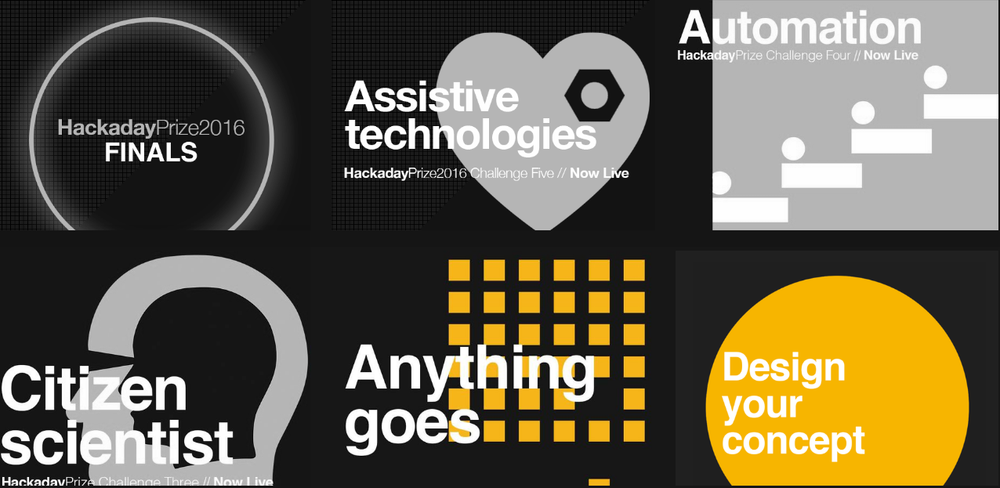
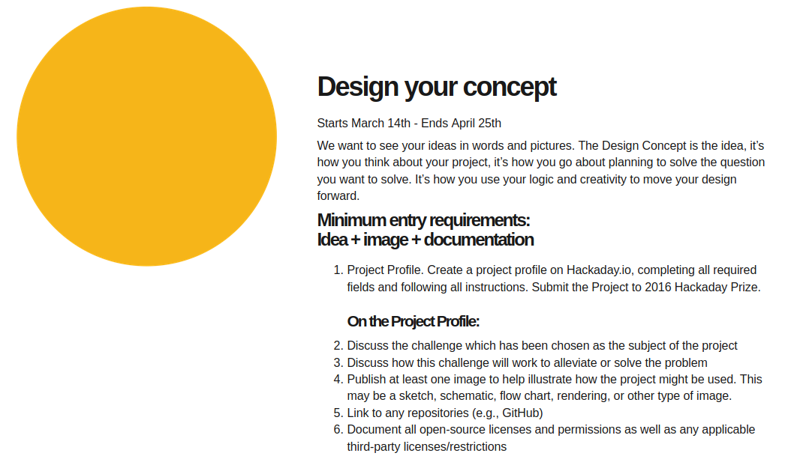
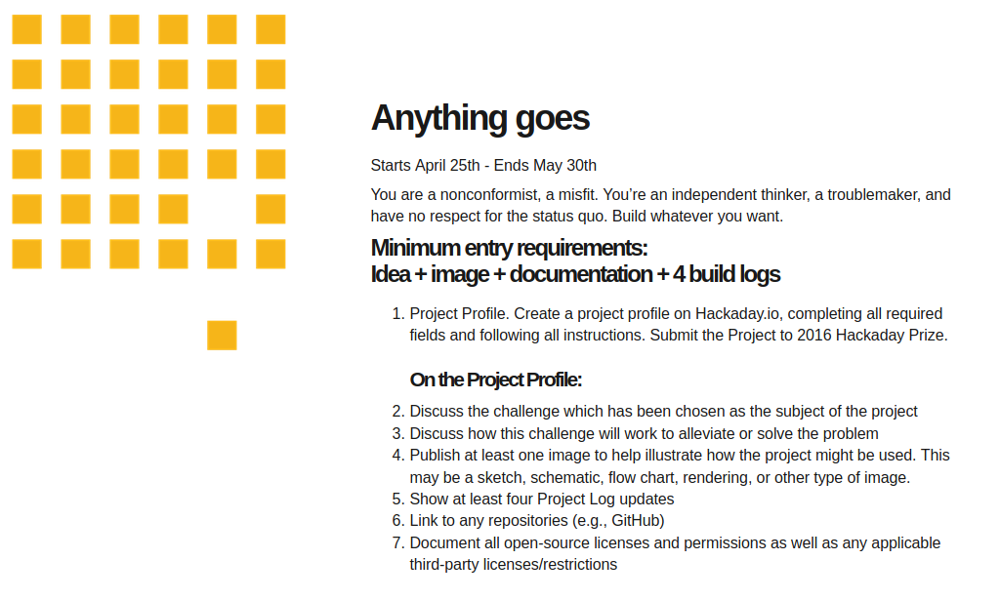
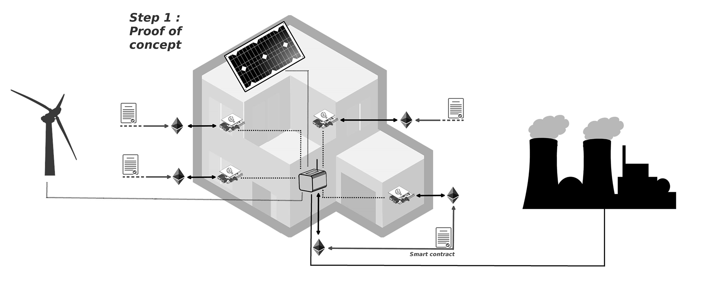

# Ep. 2 - Design, concept and anything goes \[HaD Prize 2016\]

## Preliminary note : what are the "[Design your concept](https://cloud.lamyne.org/s/LecqqTARZqawjcY)" and "[Anything goes](https://cloud.lamyne.org/s/RGdoEcdezi3d7PS)" challenges about ?

### [Design your concept](https://web.archive.org/web/20160328233302/https://hackaday.io/prize/details)

> All problem solving starts with an idea or design concept to lead the way and provide direction for your design decision.

### [Anything goes](https://web.archive.org/web/20160705044827/https://hackaday.io/prize/details)

> You are a non-confirmist, a misfit. You're an independant thinker, a troublemaker, and have no respect for the status quo. Build whatever you want.

## Design of our concept

The [general proposal of the concept](https://app.gitbook.com/@la-myne/s/daisee-citizen-research-program/daisee-season-1/ep.-1-call-me-daisee-the-hackaday-prize-root-of-the-projet) could be summarized as followed : build the "Internets of Energy" and organise energy as a common by deploying open-source secured decentralized autonomous energy production systems and consumption monitoring relying on micro-grid infrastructures that enable trusted peer-to-peer energy transactions.

The design question would be : do blockchain "technologies" have a role to play in energy transition projects ? and if "yes", what form does it take and how to you shape it ?

To work out this question, the aim is first to experiment a local micro-electricty sharing network in 3 steps :

* the hardware layer: building the electricity sensors coupled to the IoT device that will enable sensors to talk to the local Ethereum blockchain and make it possible for the sensors to talk to one another;
* the software layer: connection to the local Ethereum blockchain, and make it possible for sensor to communicate with each other and share data, call a "smart-contrat" that automate the virtual energy transaction and the effective token exchange
* the infrastructure layer: make the system capable of effectively sharing electricity between peers on the network, in consistency with their actual production and consumption, assuring the global energy balance of the system.

As we will see in the next episode \("Citizen Scientists" adn "Automation"\), we rely on

* [CitizenWatt](https://web.archive.org/web/20160322165735/http://www.citizenwatt.paris/) + [Pine64+](https://www.pine64.org/) + [Arduino](https://www.arduino.cc/) for the hardware part 
* Local [Ethereum](https://ethereum.org/) nodes + [Smart Contract](https://en.wikipedia.org/wiki/Smart_contract) \(nothing that "smart" nor that "contract" in here in fact\) + Sensors' communication for the software part
* Production + Consumption + Cables + [Arduino](https://www.arduino.cc/) \(for automated switch\) for the infrastructure part

## Anything goes : mission to Mars



### **Why Mission to Mars ?**

[SpaceX aims at sending people on Mars](https://storify.com/nicolasloubet/iac2016-spacex-mars) and we'll be needing to build the energy infrastructure on Mars in a way that is more sustainable and resilient than on Earth.

More over, Tesla is building the future of energy storage infrastructure and energy distribution network complementing the "well-known" "conventional" grid or micro-grid.

Then we think that, given the conditions on Mars and the necessity for energy production and distribution, DAISEE could be the future of the energy infrastructure on Mars.

### **Energy basics on Mars**

* No fossil fuel
* Solar energy \(about 50% of the earth's solar irradiation\)
* Wind power energy : Mars is a windy planet
* Nuclear fission/fusion since there are nuclear fuel on Mars
* Plant based electricity production
* Carbon dioxide sublimation \(solid to gas transformation\) &gt; energy generation

### **Grid infrastructure basics**

* Low pressure and gravity \(surface gravity: 38% of that on Earth...\)
* The Mars landers Viking I, Viking II, Pathfinder, Opportunity Rover, and Spirit Rover identified aluminium, iron, magnesium, and titanium in the Martian soil" \(see Wikipedia\), confirming that materials on site con be used to build the infrastructure
* Temperatures are very low, thus enabling more efficiency for electrical distribution systems.

We thought about this Mars project because it makes you think out of the box the potential application of DAISEE in both a new and a known environment: 

* new since it put some more constrains that we are not used to deal with, 
* known because Mars is a planet with limited ressources as we know it on Earth.

Thinking and building DAISEE on Mars, enables to think about innovative ways to distribute and exchange energy.

## Ending note

It turns out that we've been selected from our "Design your concept" proposal along with 20 other top proposal and selected to participate to the final round ! We now have to proove that its worht it ...

