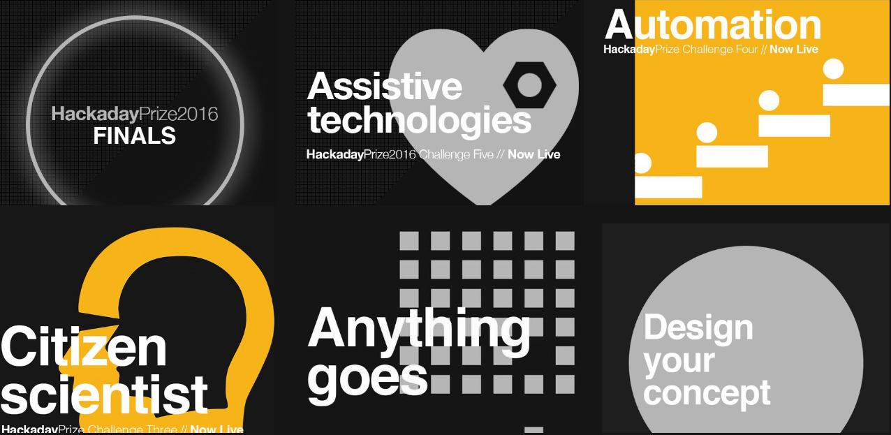
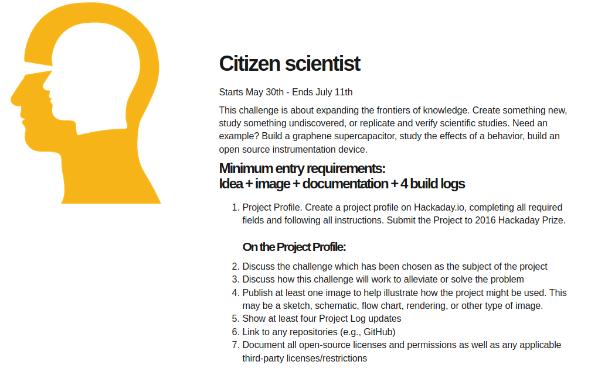
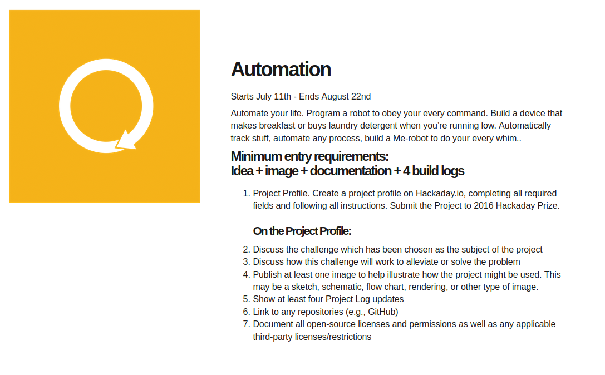
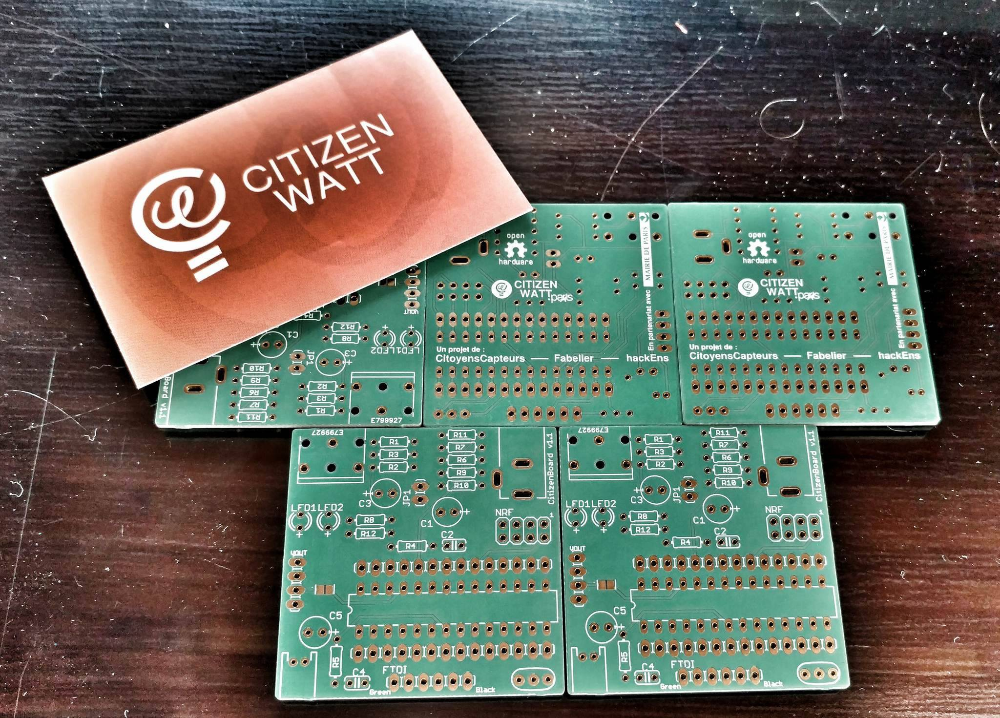
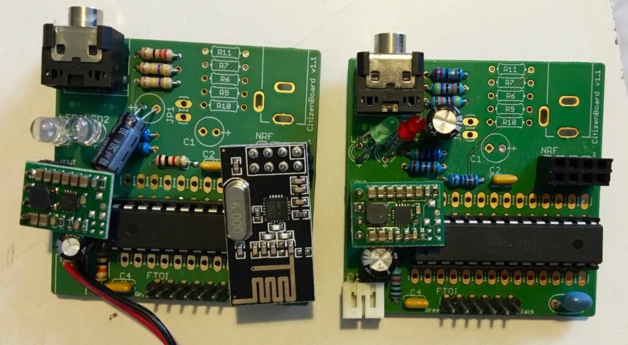
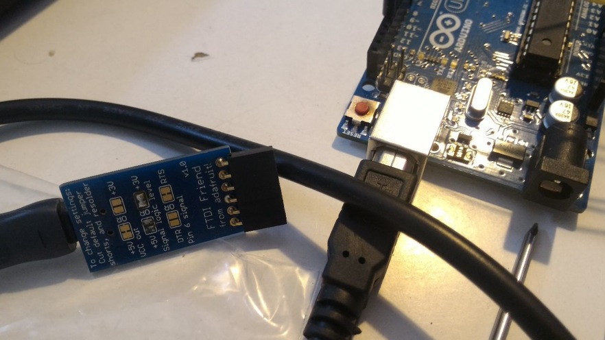
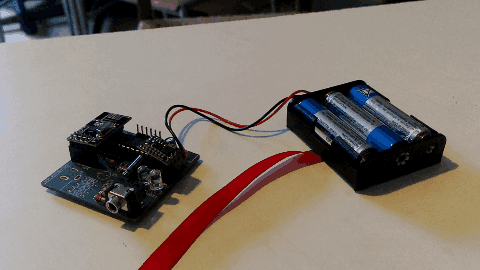
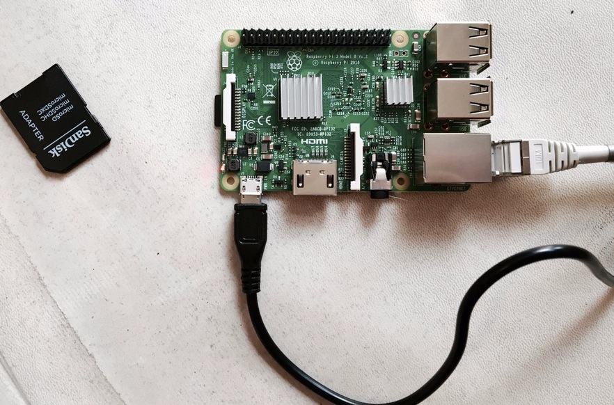
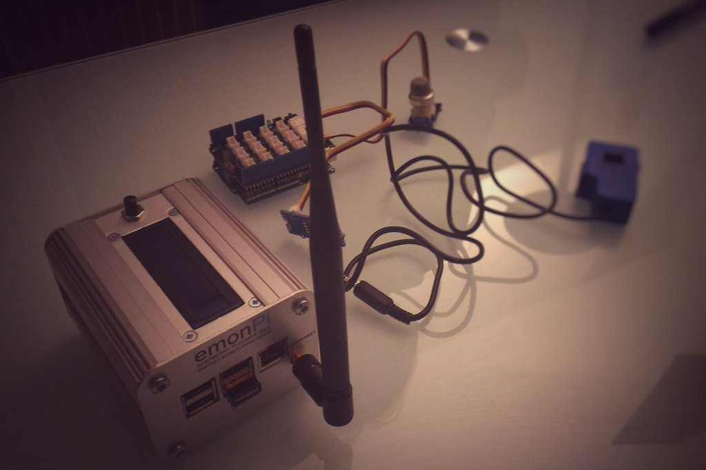
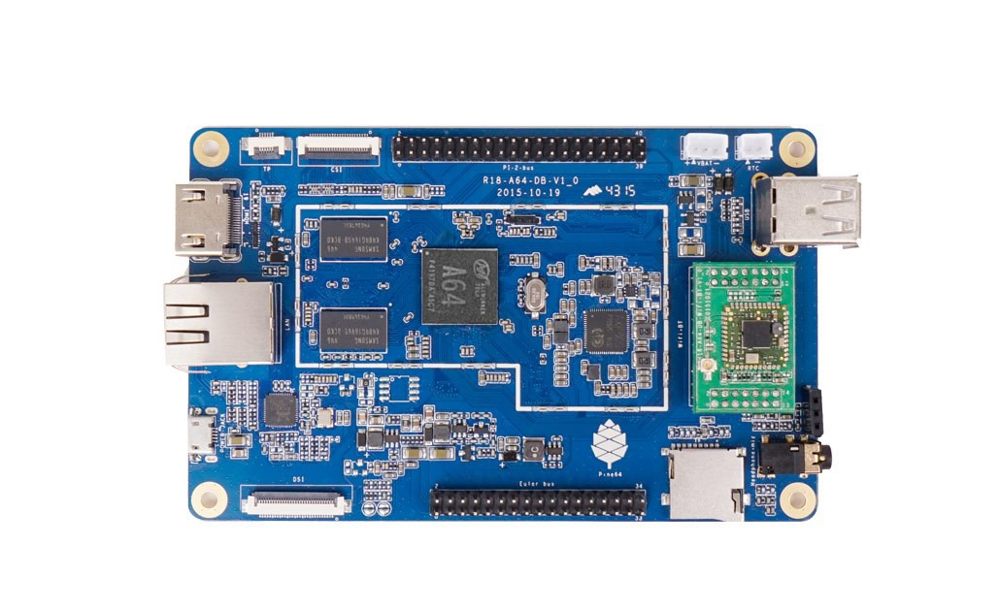

# Ep. 3 - Citizen scientists and automation, the way to prototyping \[HaD Prize 2016\]

## Preliminary note : what are the "[Citizen Scientist](https://cloud.lamyne.org/s/JLTw5YzcLzD3X9w)" and "[Automation](https://cloud.lamyne.org/s/kFKEngJWnAdw8yK)" challenges about ?

### [Citizen Scientist](https://web.archive.org/web/20160328233302/https://hackaday.io/prize/details)

> Expend the frontiers of knowledge . Create something new, study something undiscovered, or replicate and verify scientific studies.

### [Automation](https://web.archive.org/web/20160705044827/https://hackaday.io/prize/details)

> Automate your life. \[...\] Mak your life and others' live easier by reducing manal tasks that suck the life out of you.

## Camps for science and automation

Two "camps" at the cross border of citizen science and automation has structured our ptotoyping work at the begining : 

* the "**CitizenWatt Camp**" is about working out the sensoring part with [CitizenWatt](https://web.archive.org/web/20160322165735/http://www.citizenwatt.paris/) \(a citizen energy program for the reappropriation of energy consumption data\)
* the "**Ethereum Camp**" is about connecting the sensors to a local blockchain to enable autonomous energy transactions between energy peers

Those camps are actually part of  broader camps :

* A [multi-sites SummerCamp](https://hackpad.com/SummerCamp-2016-Carnet-de-bord-LxNyipOhh0I) initiated by friends from [Le Biome](http://lebiomefablab.wixsite.com/lebiome)
* A design purpose camp call DozeCamp, related to the link between nature, humans and technology, in the context of the coming [International Biennale du Design 2017](http://www.biennale-design.com/saint-etienne/)

### CitizenWatt Camp : citizen energy sensor development

#### What's "CitizenWatt" ? 

Explanation of what is [**CitizenWatt**](http://www.citizenwatt.paris/) by Olivier Blondeau from [**Citoyens Capteurs**](http://www.citoyenscapteurs.net/) \(in french not yet translated\):



#### **CitizenWatt Sensor : make it work \[Technical\]**

[@Olivier Blondeau](https://hackaday.io/hacker/134617) came at our local hackerspace \([La MYNE](https://lamyne.org)\) to help us solve the issues we had with the CitizenWatt sensors. The original PCB have been provided directely by CitizenWatt for the DAISEE team for the sake of the experimentation.

The first step was to compare the hardware part to make sure there were no issues compared to a CitizenWatt sensor that works :

No issues were found. It appears that the trouble came from the software and more particularly the way we flashed the ATMEGA. Indeed, after following [the flashing process](https://web.archive.org/web/20170101035345/http://wiki.citizenwatt.paris/doku.php?id=flashage_de_l_atmega_et_calibration_du_capteur) using [a FTDI programmer](https://www.arduino.cc/en/Main/ArduinoBoardFioProgramming) \(Code source: [sketch Arduino](https://github.com/CitoyensCapteurs/CitizenWatt-sensor/blob/master/Software/sensor/sensor.ino)\). 

_**Note** :_ [_here can be found the documentation about this CitizenWatt repairing session \(in french\)_](https://paper.dropbox.com/doc/DAISEE-Construction-CitizenWatt--A1uMdPAEe99gjBYUDwYN7JgdAg-QBosHpGM6SMTeBDP6nskR). 

We ended up with five working CitizenWatt sensors.

Once the CitizenWatt sensors are working it is necessary to couple the sensor to a Raspberry PI in order for the CW-sensor to communicate the data it senses \(through RF in this v1 version of the board and through Low Energy Bluetooth in the coming v2 version of the board\). This means that it is necessary to install the CitizenWatt disk image and interface on the Raspberry Pi.

It turns out that it works well with the Raspberry Pi 1 but it doesn't work with the more recent ones since this is not the same architecture. This leads us to another issue then : we need to build the CitizenWatt UX image and boot for a Raspberry PI 3 \(that is more powerfull than a Raspberry 1 and might be right to mine as an ethereum node\). Clement D., one of the core developer of CitizenWatt thus took some with us to build and test. 

However, we did test the good functioning of the CitizenWatt on site with a Raspberry Pi 1 install... and it worked well. However, it turned out that RF is not powerful enough to push data from one floor to the other in the house.

At the end of the day, we still have some trouble to boot the CitizenWatt disk image on a Raspberry Pi 3. Moreover, architecture of the v2 PCB of the CitizenWatt sensor is to come and should be more interesting for our need. However, for the sake of experimentation we carry on with the v1 for the moment. You'll find all the necessary information about the PCB plans and codes of the CitizenWatt sensor [AT THIS LINK](https://github.com/CitoyensCapteurs/CitizenWatt-sensor) \(GitHub repo\).

Beyond the use of CitizenWatt sensor, we also investigate the use of [Open Energy Monitor](https://openenergymonitor.org/) to montor both energy consumption and production. 

### Ethereum Camp : energy transaction automation

As part of the development of some bricks of the DAISEE program, two of the main technological bricks are:

* How to make Smart Energy Monitoring/Meter IoTs work like Ethereum blockchain nodes that can talk to each other via a local blockchain, as well as make and validate transactions ?
* How to automate the transactions management ?

#### Setting-up the ground

Preliminary steps we required to adress the mining capacity on Raspberry PI 3 or any other supporting device :

* _For the_ [_**Ethereum Installation \(RaspberryPi\)**_](https://hackpad.com/DAISEE-Ethereum-Install-RaspberryPi-N60aExvyCPC) _**using GETH** and an_ [_**alternative way for the Installation of an Ethereum node on a Raspberry Pi**_](https://hackpad.com/DAISEE-Installation-dEthereum-sur-RaspberryPi-parity-RMpwqLyOwSq) _**using PARITY**_
* _For the_ [_**Design & Deployment of SmartContrat Peer-to-peer Energy**_](https://hackpad.com/DAISEE-Design-Deploy-SmartContrat-Peer-to-peer-Energy-o1vtMr8RW73)
* _For the_ [_**Design & Deployment of DApp**_](https://hackpad.com/DAISEE-Design-Deploy-App-sTLyhw9iOaO)

For a DApp demo, see



#### **Ethereum mining nodes on Raspberry PI 3 or any other support**

We do not have so much trouble to make Raspberry PI working like an ethereum node of a common private blockchain. Our issues come from the fact that in order for the nodes to participate to the validation and transmission of blocks to the common private blockchain, it is necessary for this node to have mined at least once to generate the DAG file \(necessary for the propagation of the blocks in the blockchain\). The fact is that for the moment raspberry pi \(1, 2 or 3\) does not have enough power to mine.

[**Here are some of the trials**](https://hackpad.com/DAISEE-2e-DAISEECamp-0816-VyMwEnbsRqA#:h=6.3--Tentatives) made to overcome this issue:

* Increase the swap memory of the card
* Generate the DAG file without mining \(meaning to generate the DAG file on a computer and copy it onto the Raspberry card\)

None of those tests are conclusive. As a result, we've decided that it could interesting and more relevant to change the ethereum node support : from a **Raspberry** to a [**PINE64+**](https://www.pine64.com/product). _**Note** : This choice was made because_ [_@Sam_](https://hackaday.io/hacker/130437) _got one and because it is more powerful than a Raspberry._

After installing an Ethereum Node onto the **PINE64+** it turns out that... **MINING WORKS** and **PROPAGATION of the the blockchain also WORKS;** documentation is [**HERE**](https://hackpad.com/DAISEE-Installation-Ethereum-et-CitizenWatt-sur-un-Pine64-CCIvAqntMVV).

## Enhancing citizen science and automation : hackathons, meet-up and working groups

Both the Citizenatt and Ehtereum Camps have been fed and feeding other dynamics that aim at enhancing the citizen root of th projet and the will for building autonomous energy systems. Amongst those dynamics two of them have been relatively important in 2016, along with the Hackaday Prize.

### CompteurConnect Hackathon

The \#CompteurConnect hackathon held by the French ministry for environment, energy and ecology has given the DAISEE team the opportunity to:

* Make the project vision clear & work on the global design of the project
* Work on a \(proto\) [smart contract](https://github.com/Xalava/Daisee/blob/master/Daisee.sol) based on the ethereum blockchain that simply enable to a person who produce a surplus of electricty to exchange this surplus with another person who is consuming in exchange for a token.

This smart contract is the first energy peer-to-peer contract based on the Ethereum blockchain. It works more or less... still need improvement and it's modest in its structure and on what it is doing but still... the first energy smart contract.



### Blockfest \#1 

Between the 6th and 12th of June, the [**Blockfest**](http://blockfest.fr/) was held at [**Ecole 42**](http://www.42.fr/) in Paris.

We were there to welcome new members to the contributors team and work on a very first prototype: how to make 3 independent RaspPi Ethereum blockchain nodes to communicate with each other and make transaction. [Documentation can be found here. ](https://paper.dropbox.com/doc/DAISEE-BlockSprint-Log-Book--A1uM6pPu3D1cpvk2cpJhpeRrAQ-KH1i0nrU5HAayxARk0sMf)



