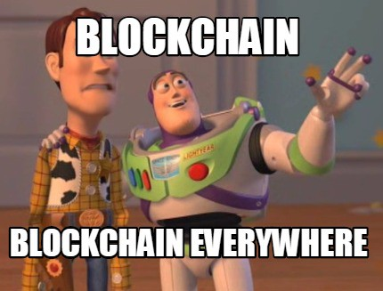
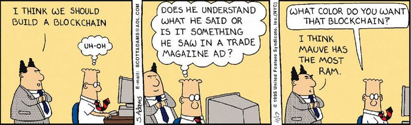
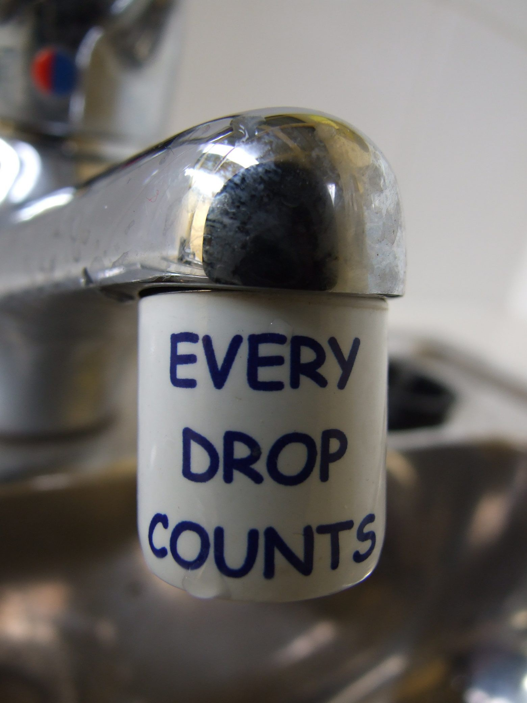
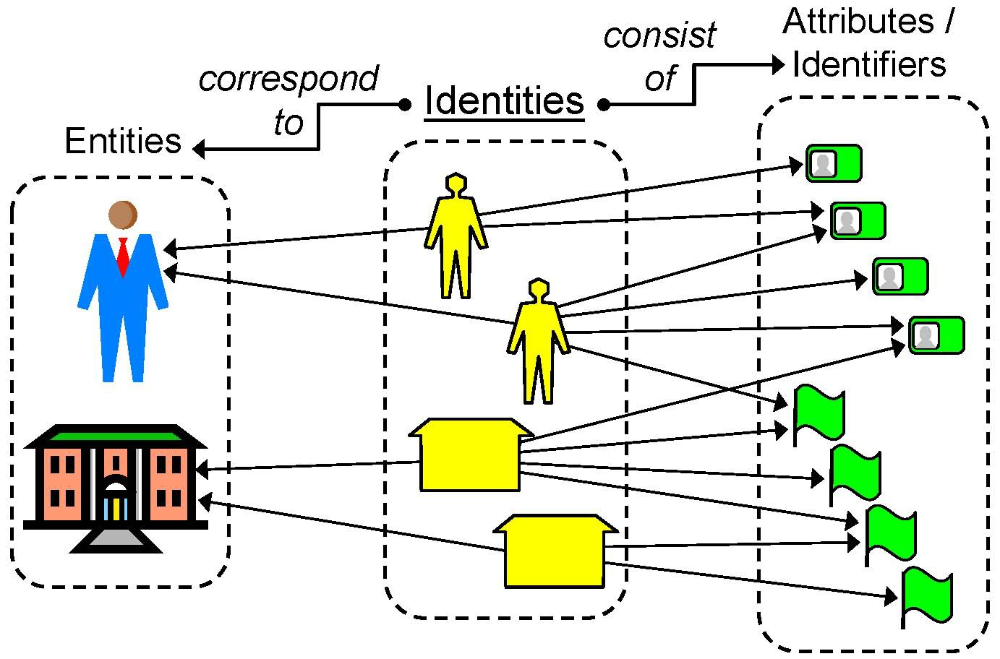
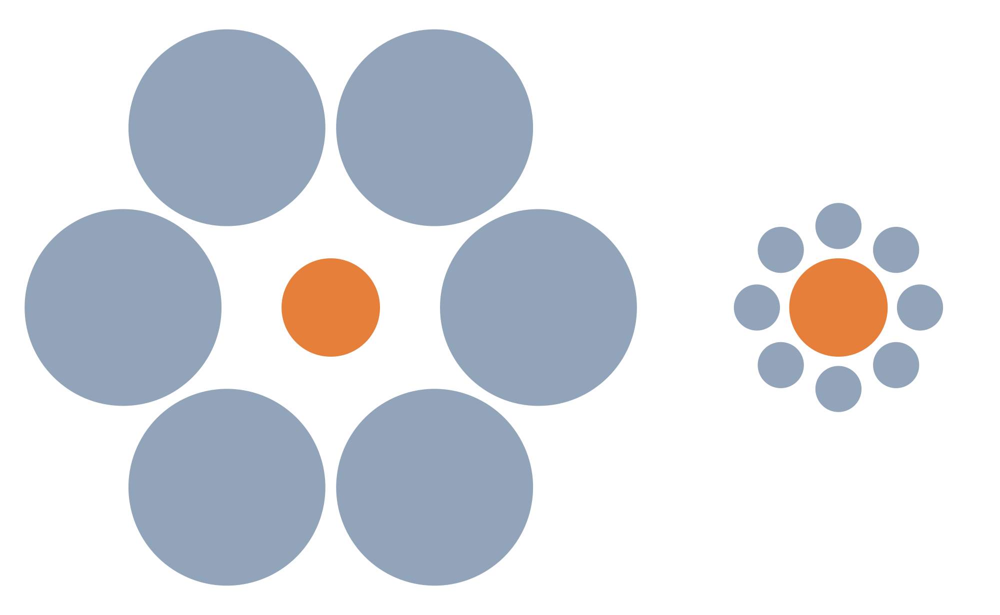
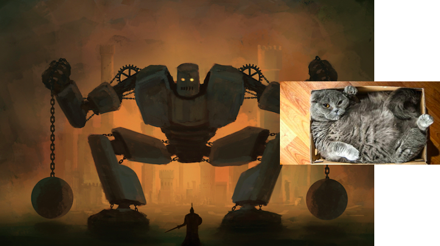
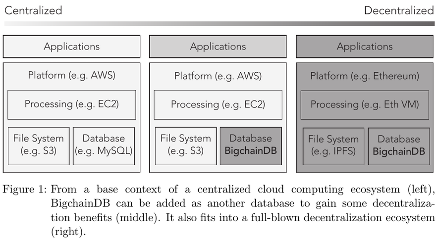
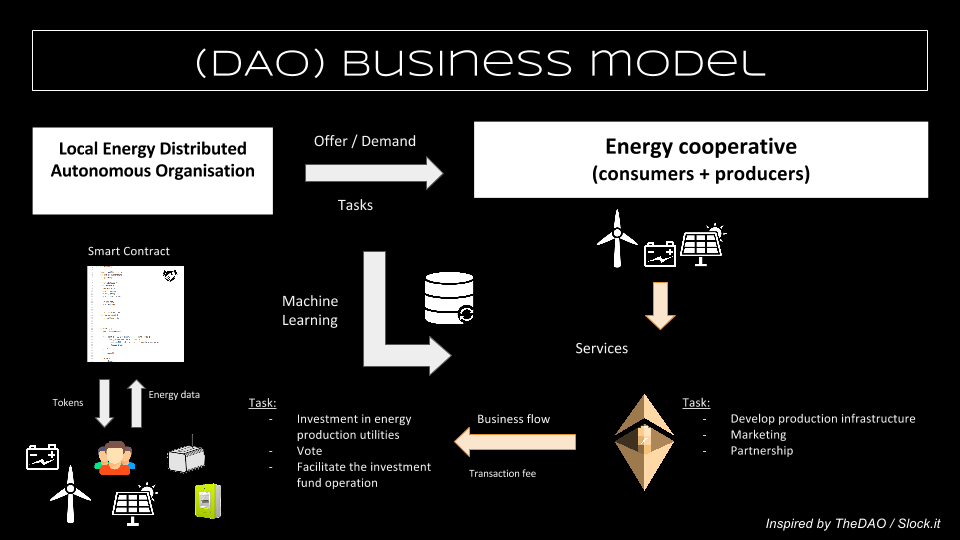
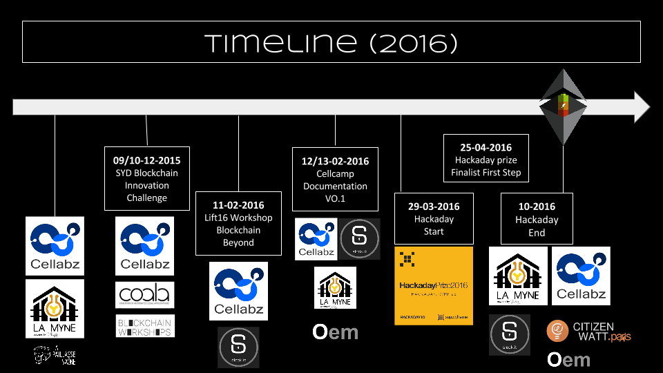

# Ep.4 - Final : Blockchain is fun... but what's next for energy?! \[HaD Prize 2016\]



## "Blockchain... blockchain everywhere"

Blockchain technologies are interested to think transparent and secured peer-to-peer distribution in sectors where a limited amount of middle-men takes the large majority of the room. To put it in a more practical way:

* in the banking and financial ecosystem, trusted by few banks, funds and multi-national companies, [Bitcoin](https://en.wikipedia.org/wiki/Bitcoin) \(on of the first implementation of blockchain technology of our age\) makes it possible, in specific activities, to get ride of the middle-man and enable direct peer-to-peer transactions.
* in the same way, **in** **the energy sector**, depending on the countries, grid and production are usually trusted by a few actors, and clearly not interoperable with other infrastructures operators \(EV for instance\). A bit like for Bitcoin - with potentially a much more complex ecosystem, thus requiring **to think beyond the blockchain tech itself** - some "blockchain technologies" are an excuse to think distributed, transparent and secured peer-to-peer energy systems. We do use the word '_**excuse**_**'** because, as we'll notice later, blockchain technologies do not answer every needs of dsitributed peer-to-peer energy transactions, and even bring limitations that necessitate to choose the part of the blockchain technology that we can use in a context where hybridization with other technologies is essential.

To be a bit provocative, we would then say that blockchains as blockchain tech won't revolutionize anything if thought and taken at continuous industrial and economical paradigm. What's interesting, and ground for potential revolution, is the spirit and the potential of hybridization and interoperation with other technologies, and appropriation by sectors and communities that 

1. think "outside-the-blockchain-box" of blockchain tech to embed social and infrastructure design of ther core activities;
2. necessitate to deeply reconfigure the way to think technology, economy, social and politics as well as law and regulation.

### What are we capable of doing with blockchain technologies at our scale ?

The blockchain technology that we use \(**local private** [**Ethereum**](https://ethereum.org) **blockchain**\) makes it possible to **automate** **virtual electricity transactions** between peers based on a algorithm \(**"smart-contract"** - that has nothing such as _smart_ nor _contract_\) on a 4-nodes based distributed, transparent and "secured" database. We are also capable of **initiate physical effective electricity transactions** from the required producer to the consumer who's in need - operated by the "smart-contract" that triggers from which producer the calling consumer buys its electricity.

### What are the limitations that we came across while applying it to the energy sector ?

_**Please note** that those limitations might have been overcome by other people. However, for the moment we do not have enough details in our hands to assure that those have been effectively overcome._

Here we'll try to spot the main limitations of blockchain technologies applied, in our case, to the energy sector :

* "Blockchain technologies makes it possible to make small transactions at a really low-cost" : the low-cost of small-amount transactions is verified in the case of limited interaction with the blockchain. If continuous interaction with the blockchain is required \(such as registering in-real time production and consumption of each peer\), then the fees pilling up can entails high amount bills.

*  "Blockchain technologies makes it possible to identify a verifiable, auditable and authentic user" : the users are pseudo-users \(it's not anonymous but pseudonymous\). Moreover, the blockchain technologies do not verify, label or guaranty the user, or the data the user puts in it. As we put it lovely : "shit in shit out", blockchain technologies are transactional tools with inputs and outputs. The inputs need to be validate in order to call the blockchain a "tool for the guarantied and validated information".

* "Blockchain technologies certify and make transaction more secured, reducing the risk for fraudulent actions" : this is true, provided the consensus process of validation of the transaction works fine.

* "Blockchain technologies make information transparent for peers" : this is true, provided that you give the necessary keys to read the information.

* "Blockchain technologies make real-time transaction possible" : not really. It is faster than a Western Union transaction. However, due the consensus process validation \(mining process\), blocks validation, for a blockchain used on a regular basis, takes from a few second to few minutes \(and sometimes hours\). This is not real-time and that is a limitation in the case the energy where it might be necessary to guaranty in "real time" the consumed and produced amount if we want to keep the link between the transaction process and the physical electricity exchange process. _**Note** : by the way, what "real-time" means ?_

* "Blockchain technologies make it possible to store any kind of data" : it depends on the blockchain technology and it becomes a limitation while talking about the amount \(volume\) of stored information. Blockchain technologies are not designed to store huge amount of data, since the more data you store, the heavier the blockchain, the more you loose in flexibility and distributed potential.

* The Proof of Work \(PoW\) process uses a lot of computational power, thus consuming a lot of energy. This is quite paradoxical while running a project/program about energy transition. This is hard point that required to be worked out since scaling would require larger amount of computational power if using PoW. Other potential consensus validation process can be used such as Proof of Stake \(PoS\) for instance.

Consequently, there are currently \(end of 2016\) strong limitations to the use of blockchain technologies, taken alone, to develop and operate scalable distributed peer-to-peer electricity exchange and transaction infrastructure. However, blockchain technologies are really good bases to start working on such a system.

That's what we've tried to achieve during those past 5 month : to determine the relevance of the use of blockchain technologies in the energy sector to build the conditions that favor transparent, secured, pseudonymous peer-to-peer electricity transaction; and, if not completely relevant, what are the ways we need to work to answer the issues we're facing. We've also achieved strong community federation around the DIASEE program.

We've still got more questions than answers, since in any exploration phase, you experiment things that few or none have tried or sorted out. We are convinced that we've build strong expertise on blockchain technologies. It's time to explore the hybridization of the technology with other emerging technologies that could answer our current and possible future issues as well as to dig in other disciplinary fields \(law, economics, politcs, social, organization, governance...\) and anchor the dynamic to the ground field.

## What's next and how do we see a workable distributed peer-to-peer electricity exchange/transaction system ?

From a technology point of view, a workable distributed peer-to-peer electricity transaction system won't be a blockchain-energy system; it would probably be a blockchain-IPFS-BigChainBD like system.

Other solutions are emerging such as Proof of Stake \(PoS\) or lightning process \(off-chain transaction and validation processes\) helping to leverage the current blockchain barriers.

Given the current limitations of the main blockchain technologies with regards to the energy sector, it would be interesting to work on :

* How to make real-time transaction ?
* How to store the data and keep immutable track of it ?
* how to make the use of blockchain-like technologies less power and energy consuming ?
* How to make it cheap to use ?
* How to make sure that i the initial information is correct and validated, and that energy-fraud is not possible ?

Why are those questions relevant ?

* Because local flexibility required reactivity, thus the necessity to link the physical electricity exchange with the data-based electricity transaction;
* Because energy data \(meaning consuming and producing patterns and predictions\) are key for the grid operators and producers;
* Because its absurd to implement at large scale, apparently, highly energy consuming technology to optimise energy consumption and production;
* Because you don't want your energy bill to be higher than it already is; you'll even want it to be lower so as for anyone to have easier access to energy;
* Because auditability as well as guarantied and validated data are key to trust within an open environment

Today, we hardly see a workable distributed peer-to-peer electricity exchange / transaction system without current large stakeholders, like energy producers, grids operators, local governments... we also hardly see its development without a data operator. And last of all, we do not see it without the ones who consume the energy, thus necessitating to address the _**governance**_ question.

As a result, we will carry on working on the 3 levels of the DAISEE program:

* the hardware level : the convergence between IoT, blockchain and other enabling distributed system to propose an open-hardware relevant and consistant energy meter ;
* the software level : using Ethereum blockchain as a basis to build a distributed energy data infrastructure with the possibility to run automated, transparent and secured peer-to-peer contract;
* the infrastructure and governance level : how to physical deal with peer-to-peer energy exchange and to build a local energy market place.

## What are the next steps for the future development within the DAISEE citizen research program ?

**The very next step** for te DAISEE team is to consolidate the accumulated documentation during those past 5 month and capitalise on those.

* **The second step** for us is now to clearly set the technologies we will use for the IoT part and the distributed energy data infrastructure.
* **The third one** is to carry on building strong links with diverse contributors around the world, and consolidate either partnerships or at least cross work with them.
* **The fourth step** would be re-work both the IoT part and distributed energy data infrastructure on the other part with both economical, institutional and citizen shareholders.
* **The fifth step** will be to effectively deliver a pilote functioning in real-usage conditions.
* **The sixth** **step** will be to work-out what could be called the business model of a DAISEE community on the topic, which might look like something like that:

The hackaday prize challenge clearly gave us a line to prototype and test the technical development of part of the DAISEE program. It has been a great experience we will carry on wether or not we're top finalist.

**The next big step** for us is to find an experimentation field to confront to the reality of the territories and real-usage conditions with either local governments or companies, or both. It would help accelerating R&D development in a process of research-action experimentation program, that may transform into a viable dynamic.

> **Ending note** : unfortunaltely, we were not in the top 5 finalist of the all 2016 hackaday prize challenge; but : what an adventure to start of community dynamic !!!

